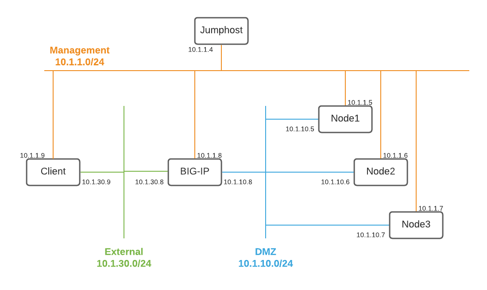

# F5 Automation Toolchain Demo

## Setup



On the jumphost, create `.env` file using [.env.example](./.env.example) as template.

Source the variables in `.env` file:
```
. .env
```

If necessary, reset BIG-IP for the demo (note that you'll need a new license key) with the instructions [here](https://support.f5.com/csp/article/K13127)

# Declarative Onboarding

[docs](https://clouddocs.f5.com/products/extensions/f5-declarative-onboarding/latest/using-do.html)

[Examples](https://clouddocs.f5.com/products/extensions/f5-declarative-onboarding/latest/examples.html)

[demo](./do-demo.md)

# Application Services 3

[demo](./as3-demo.md)

[User Guide](https://clouddocs.f5.com/products/extensions/f5-appsvcs-extension/latest/userguide/)

[Examples](https://clouddocs.f5.com/products/extensions/f5-appsvcs-extension/latest/declarations/)

# Telemetry Streaming

[demo](./ts-demo.md)

[User Guide](https://clouddocs.f5.com/products/extensions/f5-telemetry-streaming/latest/using-ts.html)

To enable debugging, add the following to the request JSON
```
  "controls": {
    "class": "Controls",
    "debug": true,
    "logLevel": "debug"
  },
```

View logs at `/var/log/restnoded/restnoded.log`
