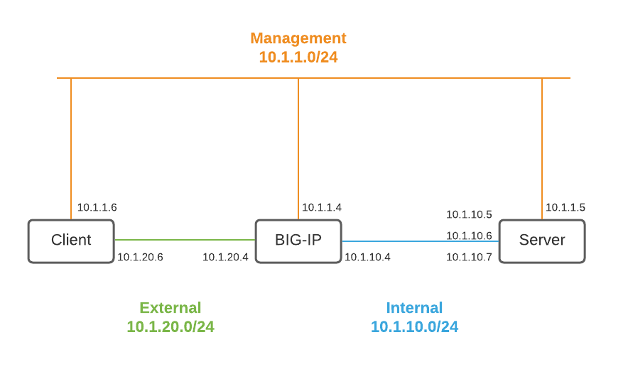

# F5 Automation Toolchain Demo



## Setup

- If working on a newly deployed BIG-IP, change the admin password through TMUI
- On the server:
  - Start 2 backend services on the server:
      ```
      docker run --restart always --name podinfo -dp 9898:9898 stefanprodan/podinfo
      docker run --restart always --name nginx -dp 8080:80 stenote/nginx-hostname
      ```
  - Create `.env` file using [.env.example](./.env.example) as a template.
  - Load the variables from `.env` into the environment
      ```
      source .env
      ```

## Declarative Onboarding

[User guide](https://clouddocs.f5.com/products/extensions/f5-declarative-onboarding/latest/using-do.html)

[Examples](https://clouddocs.f5.com/products/extensions/f5-declarative-onboarding/latest/examples.html)

[demo](./do-demo.md)

## Application Services 3

[User guide](https://clouddocs.f5.com/products/extensions/f5-appsvcs-extension/latest/userguide/)

[Examples](https://clouddocs.f5.com/products/extensions/f5-appsvcs-extension/latest/declarations/)

[demo](./as3-demo.md)

## Telemetry Streaming

[User Guide](https://clouddocs.f5.com/products/extensions/f5-telemetry-streaming/latest/using-ts.html)

[demo](./ts-demo.md)

To enable debugging, add the following to the request JSON
```
  "controls": {
    "class": "Controls",
    "debug": true,
    "logLevel": "debug"
  },
```

View logs at `/var/log/restnoded/restnoded.log`
